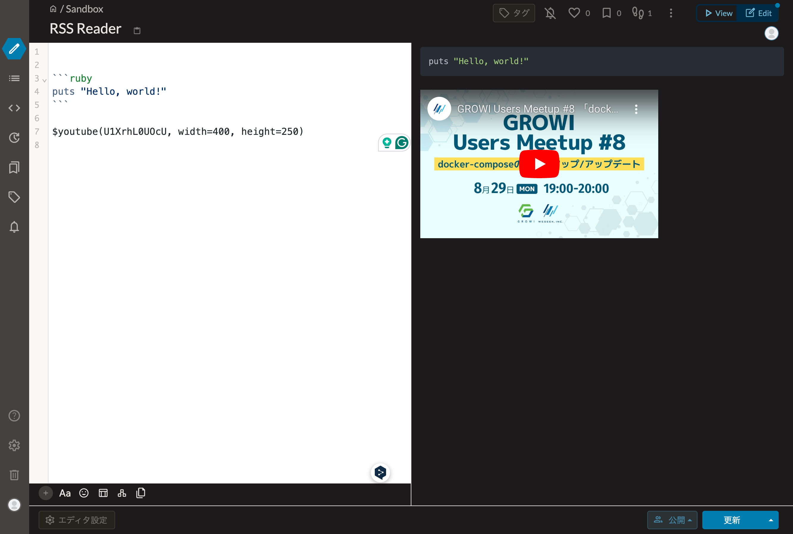

# GROIW Plugin Remark YouTube

This is a GROWI plugin that enables you to embed YouTube videos in your GROWI pages.

## Usage

### Basic usage

```markdown
$youtube(YOUTUBE_VIDEO_ID)
```



### Options

- `width` (default: 560)
- `height` (default: 315)

```markdown
$youtube(YOUTUBE_VIDEO_ID, width=800, height=600)
```

## License

MIT

